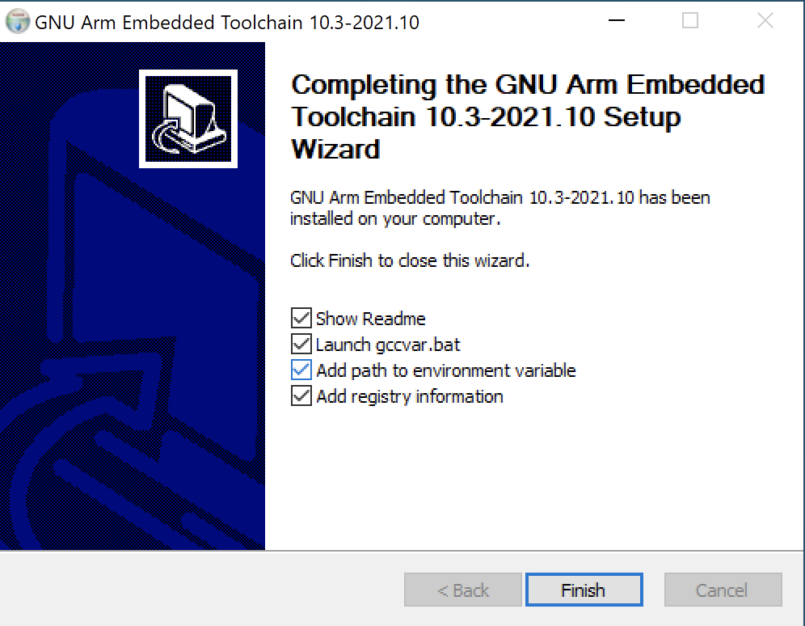
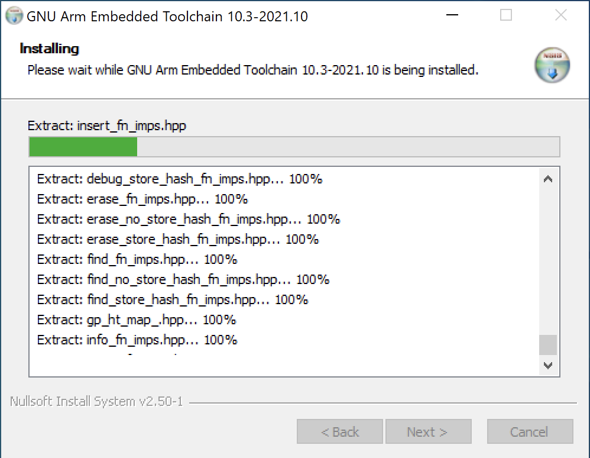
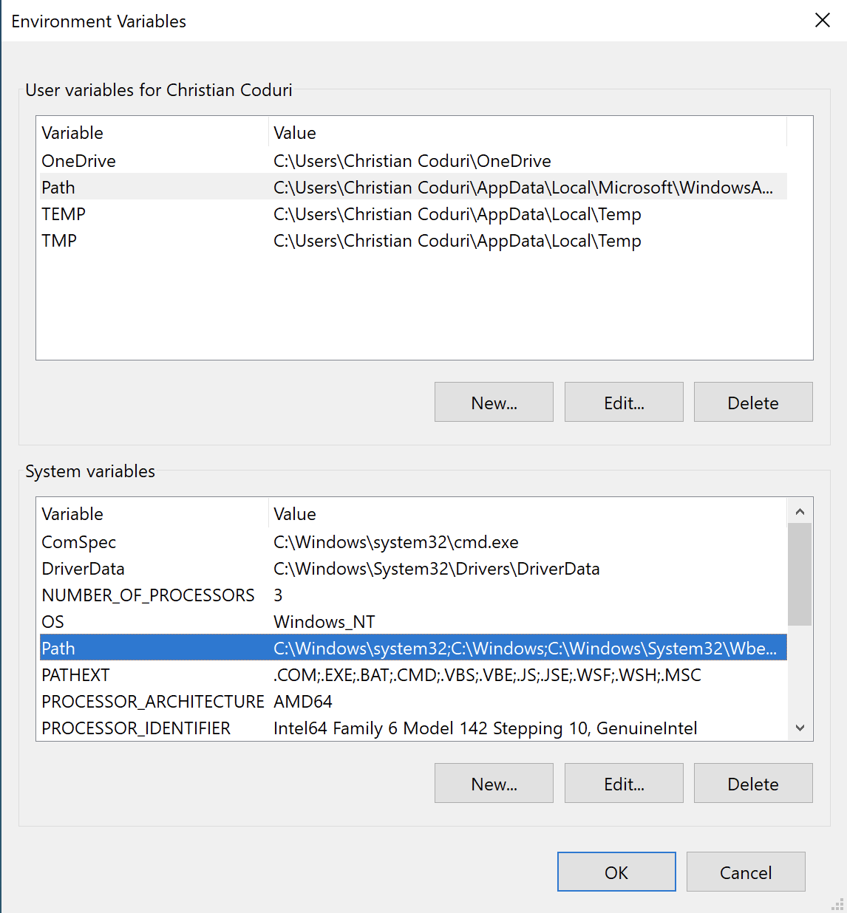
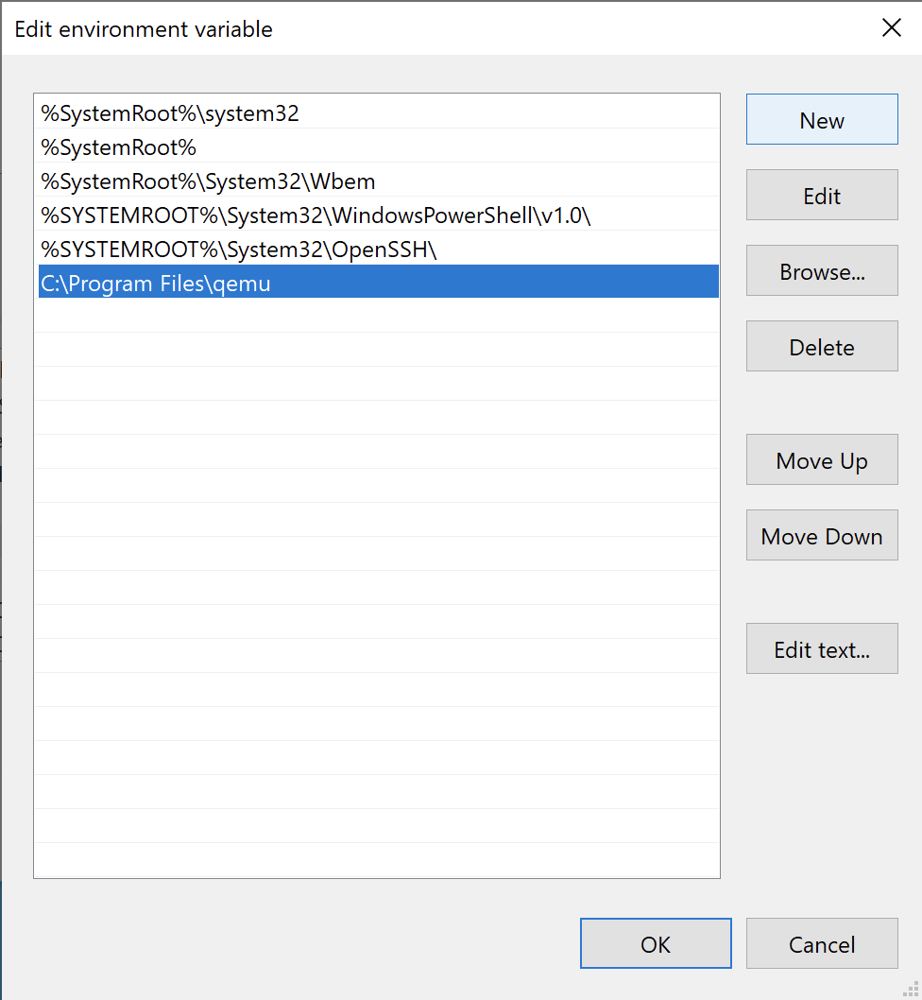
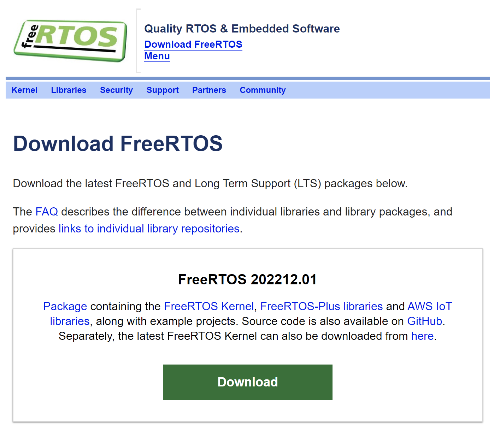
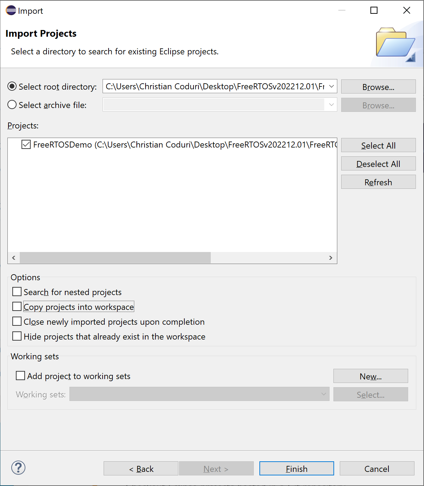
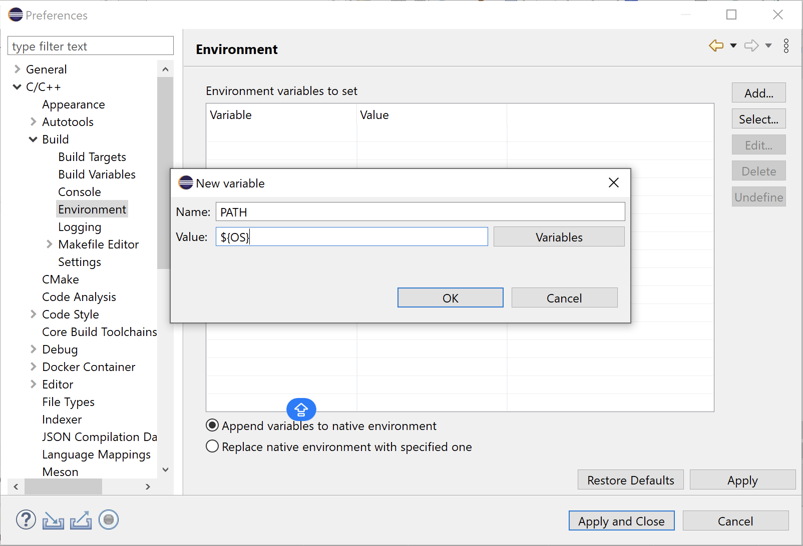
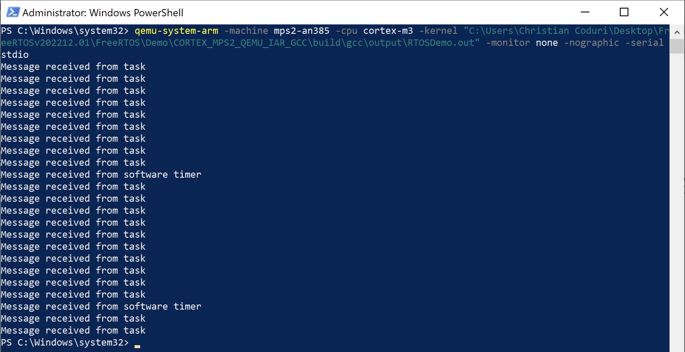

# Configuration and Installation
### How to build a demo
1. **Install an Eclipse distribution**: [Eclipse](https://www.eclipse.org/)
   - Go to _Download_ > _Download x86_64_
   - In the Eclipse Installer, you can select the normal Eclipse version for C/C++ or the one specific for Embedded systems.


2. **Install the GCC Toolchain**: from the [GNU Arm Embedded Toolchain](https://developer.arm.com/downloads/-/gnu-rm) select and install _gcc-arm-none-eabi-10.3-2021.10-win32.exe_. At the end of the download, remember to check the box "_Add path to enviornmental variable_".

<p align="center">
   
   
</p>


3. **QEMU download**: [QEMU](https://www.qemu.org/)
   - Go to _Download_ > _Windows_ > _64-bit_
   - And select _qemu-w64-setup-20231126.exe_

   After QEMU's installation, you need to put QEMU in the PATH variables:
   - _Advanced System Settings_ > _Environment Variables_
   - Add "_C:\Program Files\qemu_" to the PATH.
   
   Environmental variables come in two different categories. System and user environment variables (configured for each user) (set for everyone).All users can access system environment variables worldwide. **For this reason it is sufficient to set the environmental variables in the system**. 
 
<p align="center">
   
   
</p>


4. **Install FreeRTOS**: From the [website](https://www.freertos.org/a00104.html) (or from GitHub). In this guide, we are using: "_FreeRTOS 202212.01_".

<p align="center">
   
</p>


5. **Install Chocolatey**: [Chocolatey](https://chocolatey.org/install) simplify some of the next necessary installations.
     - Run PowerShell as an administrator
     - Write: `Set-ExecutionPolicy Bypass -Scope Process -Force; [System.Net.ServicePointManager]::SecurityProtocol = [System.Net.ServicePointManager]::SecurityProtocol -bor 3072; iex ((New-Object System.Net.WebClient).DownloadString('https://community.chocolatey.org/install.ps1'))`


6. **Download and install Make**: it is possible to do this via the official [GNU Make website](https://gnuwin32.sourceforge.net/packages/make.htm) or by using Chocolatey. In this project we decide the use Chocolatey software to install *make*. It is sufficient to write: `choco install make`.


7. **Eclipse - Import the Demo**:
   - Open _Eclipse_
   - Go to _Import_ > _General_ > _Existing Projects into Workspace_  
   - Click "_Next_" and in the next Window, select _/FreeRTOS/Demo/CORTEX_MPS2_QEMU_IAR_GCC/build/gcc_ as the root directory. Crucially ensure the "_Copy projects into workspace_" checkbox is unchecked before clicking the _Finish_ button to bring the project into Eclipse.

<p align="center">
   
</p>


8. **Eclipse - PATH Update**:
   - Go to: _Window_ > _Preferences_ > _C/C++_ > _Build_ > _Environment_.
   - Add: *PATH ${OS}*

<p align="center">
   
</p>


9. **Install MinGW**: to avoid the _"Program 'g++' not found in PATH"_ error it is needed to install MinGW by the [MinGW-w64 official page](https://www.mingw-w64.org/downloads/#msys2), or by writing in the prompt: `choco install mingw`


10. **Project > Build All**: Now, all is setted. Select '*Build All*' from the Eclipse '*Project*' menu. A successful build creates the elf file *FreeRTOS/Demo/CORTEX_MPS2_QEMU_IAR_GCC/build/gcc/output/RTOSDemo.out.*


11. **Run QEMU**: To visualize the result write in the shell:
   ```
qemu-system-arm -machine mps2-an385 -cpu cortex-m3 -kernel "C:\Users\Christian Coduri\Desktop\FreeRTOSv202212.01\FreeRTOS\Demo\CORTEX_MPS2_QEMU_IAR_GCC\build\gcc\output\RTOSDemo.out" -monitor none -nographic -serial stdio
```

<p align="center">
   
</p>


### What are this necessary things?
- **Eclipse**: an integrated development environment used in computer programming.
- **GCC Toolchain**: a cross-compiler toolchain specifically designed for compiling code for ARM architecture-based microcontrollers, microprocessors, and embedded systems.
- **QEMU**: a free and open-source emulator. It emulates a computer's processor through dynamic binary translation and provides a set of different hardware and device models for the machine, enabling it to run a variety of guest operating systems.
- **FreeRTOS**: a real-time operating system kernel for embedded devices
- **Chocolatey**: is a machine-level, command-line package manager and installer for software on Microsoft Windows.
- **MinGW** acts as a bridge between Windows and the GNU toolchain, providing the necessary tools for compiling and building software on the Windows platform.

> Written by Group 21: Armenante Pietro, Coduri Christian, Lombardi Giovanni, Serafini Luca.